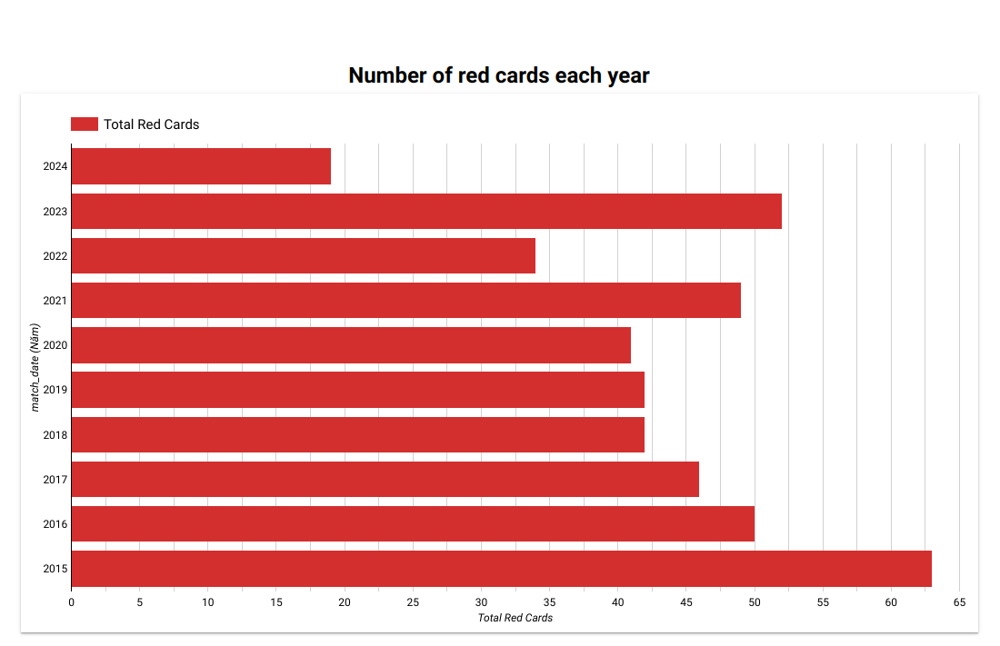
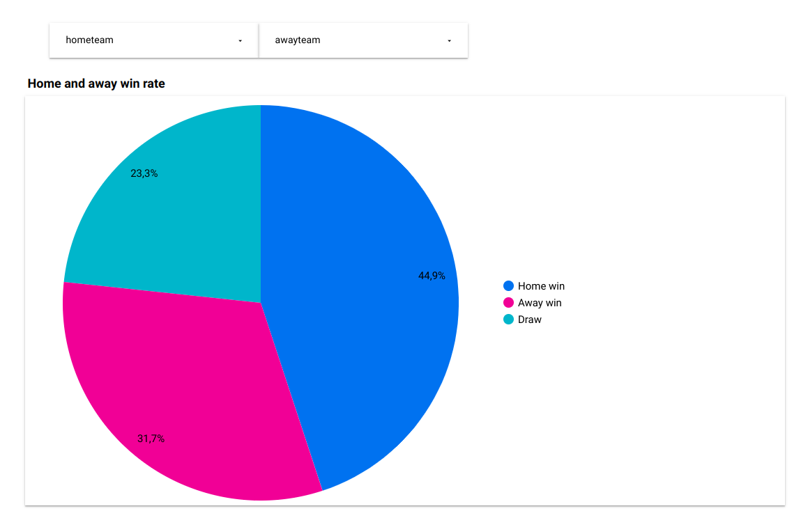
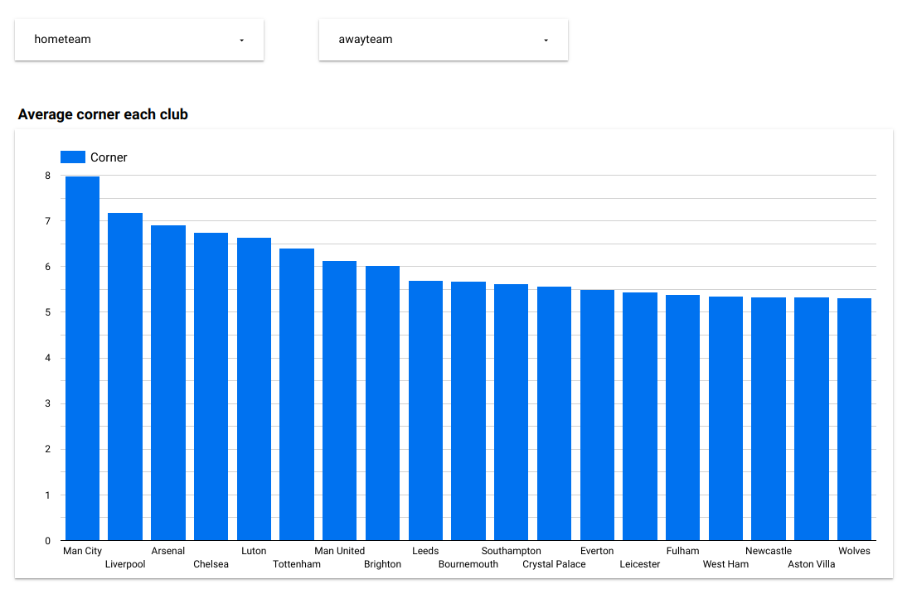

# epl_statistics
Project for the DataTalksClub/Data Engineering Zoomcamp

## Overview

This project is part of the [Data Engineering Zoomcamp](https://github.com/DataTalksClub/data-engineering-zoomcamp/), a course organization by [DataTalksClub](https://github.com/DataTalksClub/) .The goal of this project is to apply everything we have learned in this course to build an end-to-end data pipeline.

## Dataflow diagram


### Stack
* Container: Docker
* Iac: Terraform
* Cloud: Google Cloud Platform (GCP)
* Orchestration: Airflow
* Data Lake: Google Cloud Storage (GCS)
* Data Warehouse: BigQuery
* Transformation: Data build tool (dbt)
* Visualization: Looker

## Tutorial

### Prerequisites
* Installed locally:
    - Terraform
    - Python 3
    - Docker & docker-compose
* A project in Google Cloud Platform

### Setup
1. To run this project, you need to clone this repository:

    ```bash
    git clone https://github.com/truongvude/epl_statistics
    ```

2. Terraform
    * [Setup GCP](terraform/README.md) for the first time.
    * Move to terraform folder. Update variables `credentials`, `gcs_bucket_name`, `bq_dataset_name` in `variables.tf` file to your desired.
    * Run this command to execute terraform
    ```bash
    # Login to Gcloud CLI
    gcloud auth application-default login
    # Initialize state file (.tfstate)
    terraform init
    # Check changes to new infra plan
    terraform plan
    ```
    ```
    # Create new infra
    terraform apply
    ```
    
3. Airflow + Bigquery
    * [Setup Airflow](airflow/README.md) with Docker 
    * Change GCP_PROJECT_ID & GCP_GCS_BUCKET in [`docker-compose.yaml`](airflow/docker-compose.yaml), BIGQUERY_DATASET in [data_ingestion_gcs_dag.py](airflow/dags/data_ingestion_gcs_dag.py) as your config.
    * Run this command
    ```bash
    # Move to airflow folder
    cd airflow
    # Build the image (only first-time, or when there's any change in the Dockerfile, takes ~15 mins for the first-time):
    docker compose build
    # Initialize the Airflow scheduler, DB, and other config
    docker compose up airflow-init
    # Kick up the all the services from the container:
    docker compose up
    ```
    * Login to Airflow web UI on localhost:8080 with default creds (username/password): airflow/airflow
    * Run DAG on the Web Console.
    On finishing your run or to shut down the container/s:
    ```bash
    docker compose down
    ```
    * Check your external table in BigQuery.

4. Dbt
    * [Setup](dbt/README.md) your dbt account and project.
    * Go to Develop -> Cloud IDE.
    * Copy code from [this](./dbt/) folder.
    * Run `dbt build` to execute.
    * Check your dataset in BigQuery.

5. Looker Studio

    In this step you need to connect to connect table in BigQuery with your Looker Studio
    * Go to Looker Studio: [https://lookerstudio.google.com/](https://lookerstudio.google.com/).
    * Create a blank report -> Select **BigQuery** in Google Connector. Select your project, dataset and table.
    * Create your dashboard.
## Dashboard
* Link dashboard: 
[EPL Statistics](https://lookerstudio.google.com/reporting/d10255ec-a678-45e7-8dc8-4358846d88b9)






